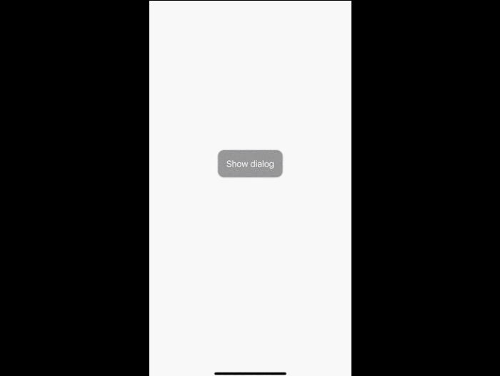
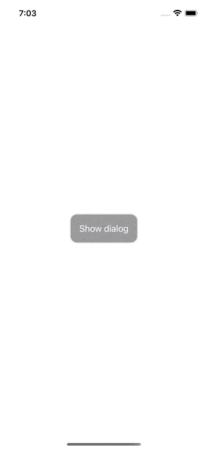
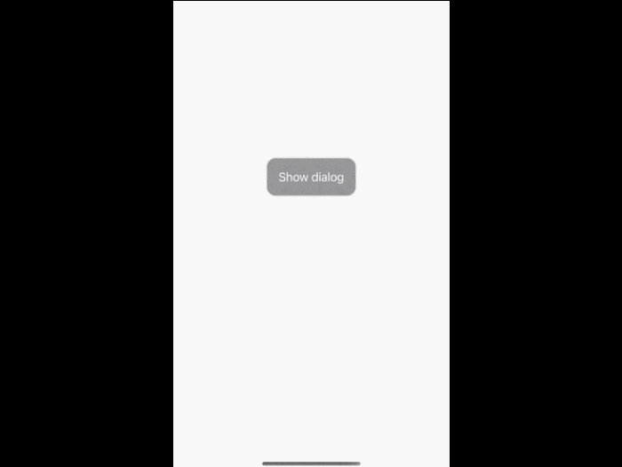

# BottomSheetUI

     



## Requirements 

**BottomSheetUI** is a SwiftUI package.

* macOS 10.12 or Greater 
* iOS 14 or Greater 


## Installation
Add this to your project using Swift Package Manager. In Xcode that is simply: File > Swift Packages > Add Package Dependency 
```swift
https://github.com/ayoubElhoucine/BottomSheetUI-iOS.git
```

## Usage
1. Import the package
```swift
import BottomSheetUI
```
2. Create a bool varaiable that will show and hide the bottom sheet
```swift
@State private var showDialog = false
```
3. Add `.asBottomSheetUI(...)` to the view you want your sheet on
```swift
YourViewScreen()
    .asBottomSheetUI(
        show: $showDialog, // a state or published bool variable to show and dissmiss the dialog
        content: { EmptyView() } // add your dialog content
    )
```

## Example
<details>
<summary>Source Code <></summary>

```swift
import SwiftUI
import BottomSheetUI

struct ContentView: View {
    
    @State private var showDialog = false
    
    var body: some View {
        ZStack(alignment: .center) {
            Button {
                showDialog.toggle()
            } label: {
                Text("Show dialog").foregroundColor(.white)
            }
            .padding(16)
            .background(.gray)
        }
        .background(Color.white)
        .asBottomSheetUI(show: $showDialog, content: BottomSheetContent)
    } 
    
    @ViewBuilder
    private func BottomSheetContent() -> some View {
        VStack(spacing: 20) {
            Spacer().frame(height: 0)
            ForEach(0 ..< 6) { index in
                HStack(spacing: 10) {
                    Image(systemName: "list.bullet.circle")
                        .resizable()
                        .frame(width: 20, height: 20)
                        .foregroundColor(.white)
                    Text("Menu item \(index + 1)").foregroundColor(.white)
                    Spacer()
                }
            }
            Spacer().frame(height: 0)
        }
        .padding(20)
        .background(.black)
        .clipShape(RoundedRectangle(cornerRadius: 16))
        .padding(20)
        .shadow(radius: 5)
    }
}
```
</details>


## Author

__ELHOUCINE AYOUB__

